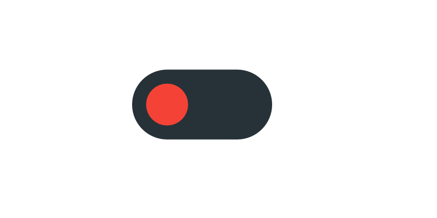

<table align="center">
    <tr style="text-align: center;">
        <td align="center" width="9999">
            

<h1 style="margin: 0; padding: 0; color: black;">Feature Flagging</h1>

<h3 style="color: black;">Delivering value while minimizing risk</h3>

<i style="color: black; font-size: 1.1rem;">
  Tech talk about feature flagging implementing adhoc or third party tools like 
  <a href="https://www.flagsmith.com">Flagsmith</a> or <a href="https://www.getunleash.io">Unleash</a>
</i>
</td>
</tr>
</table>

# Setup :gear:

## 1. Install Dependencies :hammer:

```shell
make start
```

## 2. Discover another useful commands :mag_right:

```shell
make help
```

## Extras :gift:

1. [Slides](https://www.canva.com/design/DAF-fsnuUnE/YsrQxB9KrfoMa16_24oOlA/view)